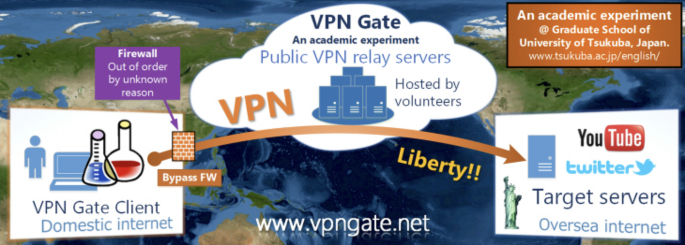
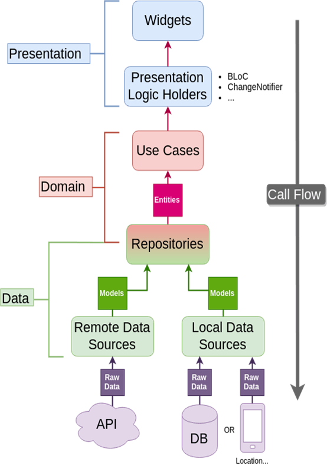
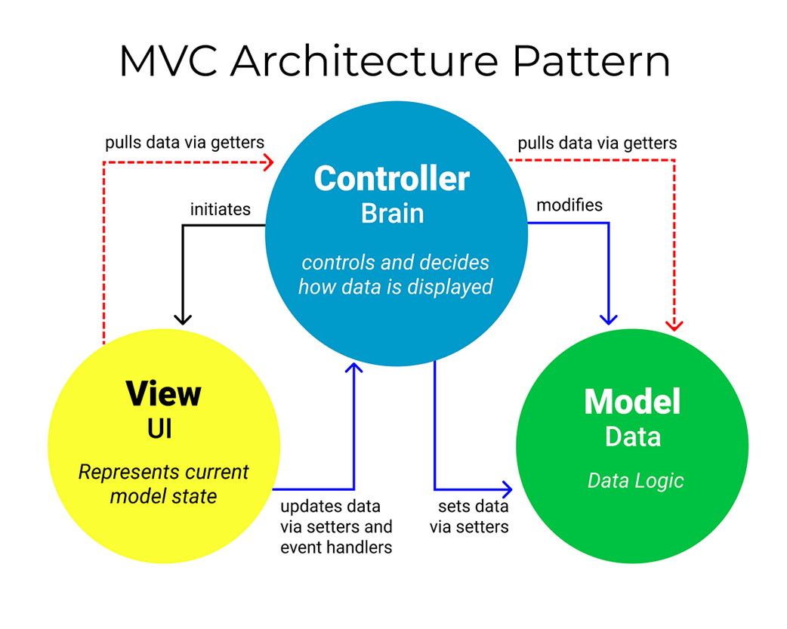
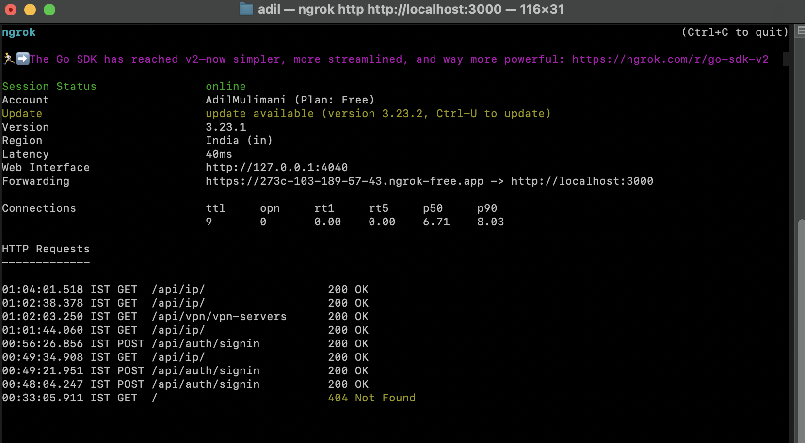

# ConcealMe - A Free VPN Cross  Platform Client App

## Motivation

During my 5th semester, I had the opportunity to take two impactful courses—**Computer Networks** and **Cybersecurity**. While I had often heard about VPNs, I never fully understood what they did or why they were important. However, through these courses, my perspective completely changed.

In the **Cybersecurity** course, I learned how vulnerable user data can be when transmitted over the internet, especially on unsecured networks. I was surprised to find out that **Internet Service Providers (ISPs)** can monitor user activity, and that this data could potentially be intercepted or exploited by malicious actors. These lessons highlighted just how critical privacy and secure communication have become in today's digital world.

Simultaneously, the **Computer Networks** course gave me a strong foundation in how data flows through networks—covering concepts like IP addressing, routing, protocols, and layers of the OSI model. With this technical understanding, the inner workings of a VPN—something that once seemed abstract—now made practical sense to me.

Combining what I learned from both courses, I was inspired to **build my own VPN client application**. It was the perfect opportunity to put theory into practice, explore secure networking technologies, and contribute something meaningful in the realm of user privacy and data protection.

---

## Problem Statement
With the rapid growth of internet usage, users are increasingly vulnerable to privacy breaches, data interception, and tracking by third parties such as ISPs, advertisers, and malicious actors. Many users are unaware that their online activities can be monitored or exploited, especially when connected to unsecured public networks. Despite the availability of VPN solutions, most are either paid, complex to use, or lack transparency. There is a need for a **user-friendly, reliable, and privacy-focused VPN client** that enables users to protect their data, mask their IP address, and browse the internet securely. To address this, develop a **cross-platform VPN mobile application** that ensures secure internet access for both **Android** and **iOS** users, while offering an intuitive user experience and essential privacy features.

---
## Solution Overview

### About VPN Gate



While researching VPN solutions, I came across [**VPN Gate - Public Free VPN Cloud**](https://www.vpngate.net), an academic experiment hosted by the **University of Tsukuba, Japan**. It is a volunteer-based project aimed at expanding internet freedom and promoting awareness about privacy and censorship.

VPN Gate is built on **SoftEther VPN**, an open-source, multi-protocol VPN solution originally developed as part of Daiyuu Nobori’s master’s thesis at the University of Tsukuba. SoftEther supports multiple VPN protocols including:
- **SSL-VPN**
- **L2TP/IPsec**
- **OpenVPN**
- **Microsoft SSTP (Secure Socket Tunneling Protocol)**

Learn more about SoftEther on [Wikipedia](https://en.wikipedia.org/wiki/SoftEther_VPN).

### Why I Chose VPN Gate

I selected VPN Gate’s servers for this project due to the following benefits:

-  **Bypass government firewalls** to access restricted websites (e.g., YouTube, news sites)
-  **Hide your IP address** to maintain anonymity while browsing
-  **Secure your internet connection** using strong encryption, especially on public Wi-Fi
-  **No registration or payment required**
-  **Highly effective at penetrating firewalls**, unlike some traditional VPNs
  
> This approach allowed me to focus on implementing secure, real-time VPN connections while leveraging a reliable and educational resource for learning and development.

VPN Gate provides an open API which makes it easier to fetch the list of available servers programmatically. I used their [public API](http://www.vpngate.net/api/iphone/) in the app to retrieve and connect to live VPN servers.

### Vpn Gate API Explained

### OpenVPN 

The VPN Gate API exposes the `.ovpn` configuration data which is based on the **OpenVPN** Protocol.

#### How OpenVPN Works

OpenVPN creates a virtual tunnel between your device and the VPN server:

1. Client connects to server using the .ovpn config file.
2. Authentication occurs via certificates, username/password, or both.
3. Data is encrypted using strong algorithms (like AES-256).
4. All your internet traffic is routed through the VPN server.


Vpn Gate provides a Comma Seperated Values String with several fields listed below.

| Field Name                  | Description                                                            |
| --------------------------- | ---------------------------------------------------------------------- |
| `HostName`                  | The VPN server's hostname                                              |
| `IP`                        | IP address of the server                                               |
| `Score`                     | VPN Gate's internal ranking based on stability and speed               |
| `Ping`                      | Measured ping (ms) from VPN Gate to server                             |
| `Speed`                     | Estimated bandwidth (bps)                                              |
| `CountryLong`               | Country name                                                           |
| `CountryShort`              | Country ISO code (2-letter)                                            |
| `NumVpnSessions`            | Number of active VPN sessions                                          |
| `Uptime`                    | How long the server has been running (in seconds)                      |
| `TotalUsers`                | Total number of users ever connected to this server                    |
| `TotalTraffic`              | Cumulative data transferred through this server (bytes)                |
| `LogType`                   | Whether the server keeps logs (usually "2weeks" or "none")             |
| `Operator`                  | The volunteer or organization running the server                       |
| `Message`                   | Optional message from the operator                                     |
| `OpenVPN_ConfigData_Base64` | Base64-encoded `.ovpn` configuration file, ready to decode and connect |
---
## Tech Stack

I adopted a modern, scalable stack across both frontend and backend layers to ensure performance, maintainability, and smooth real-time interaction.

### Frontend (Cross-Platform App)
- **Framework**: Flutter
- **Language**: Dart
- **Architecture**: Clean Architecture (core + feature separation)
- **State Management**: BLoC
- **Key Features**: VPN Connection, Speed Test, Google Admob ads.

### Backend (API & Real-time Communication)
- **Platform**: Node.js
- **Language**: TypeScript
- **Framework**: Express.js
- **Support**: REST APIs

### Database
- **Database**: MySQL
- **ORM**: Drizzle for schema validation and data modeling

---

## Design Principles

Throughout the development of ConcealMe, I adhered to well-established software engineering principles to ensure that the codebase remains clean, reusable, and scalable. These principles were followed across both the frontend and backend systems:

- **DRY (Don't Repeat Yourself)**  
  I ensured that common logic is written once and reused across the application, keeping the codebase concise and easier to maintain.

- **Composition Over Inheritance**  
  Especially within Flutter, I preferred composition when building complex UIs and components, enabling greater flexibility and reducing tight coupling.

- **Code Reuse**  
  By modularizing components, creating shared utilities, and following a layered architecture, I maximized the reusability of code across the app.

- **Program to an Interface, Not an Implementation**  
  I structured our services and repositories using interfaces, promoting abstraction, easier mocking, and testability.

---

## Architecture

### Frontend

On the frontend, I followed the **Clean Architecture** pattern to maintain a clear separation of concerns between the UI, business logic, and data layers. This approach helped me keep the app modular, testable, and easier to extend over time.



The frontend structure is divided into the following layers:

- **Presentation Layer**: Responsible for the user interface (widgets) and state management (using BLoC/Cubit).
- **Domain Layer**: Encapsulates business logic, use cases, and core app entities.
- **Data Layer**: Handles repositories, API calls, and local data storage mechanisms.

This structure ensures that any changes in data sources or presentation do not affect the core business logic.

---

### Backend

The backend system is built using **Node.js** and **TypeScript**, following the **MVC (Model-View-Controller)** architectural pattern. This helps us maintain a clean, organized, and scalable backend while supporting both REST and WebSocket-based communication.



### Components of MVC

- **Model (Data Layer)**  
  Defines the data structures using **Mongoose** and interacts directly with the **MongoDB** database. All data validation and schema definitions are managed here.

- **View (Response Layer)**  
  Functions as the JSON response layer in our RESTful API. This layer ensures structured responses, proper HTTP status codes, and error handling for all endpoints.

- **Controller (Logic Layer)**  
  Handles incoming requests, coordinates with models to fetch or modify data, and sends appropriate responses back to the client. Controllers are where core business logic resides, including booking coordination and user authentication.

---

## Features

ConcealMe VPN app provides a fast, reliable, and user-friendly experience while ensuring privacy and secure internet access. Below are the key features implemented in the app:

---

###  Authentication & Access Control

- **Email & OTP Authentication**  
  Users can sign up and log in using their email and password. OTP verification adds an extra layer of security during registration.

- **Google Sign-In**  
  Quick access using Google login for a seamless onboarding experience.

- **Account Management**  
  Complete account lifecycle support: forgot password, reset password via email OTP, logout, and account deletion.
---

###  Permissions & Offline Handling

- **Network Permission Handling**  
  The app gracefully handles network permission status, prompting the user to choose whether to accept the request of .

- **Offline Handling**  
  Meaningful UI feedback is shown when the user is disconnected from the internet, ensuring that the app handles network disruptions without crashing.

---

###  VPN Connectivity

- **VPN Gate Integration**  
  Utilizes the [VPN Gate API](https://www.vpngate.net/en/) to fetch a wide range of VPN servers located across different countries, enabling users to connect to any available region seamlessly.

- **Location Verification via IP-API**  
  Uses [ip-api.com](https://ip-api.com/) to verify if the user's IP address has successfully changed to the selected country/location after connecting to a VPN server.

---

###  Performance & Speed

- **Speed Test with Fast.com**  
  Integrates [Fast.com](https://fast.com/) to allow users to run a simple, accurate speed test before or after connecting to a VPN.

- **Local Caching with Hive**  
  Implements [Hive](https://pub.dev/packages/hive) as a lightweight local database to cache VPN server lists. This significantly reduces loading time and improves performance, especially in subsequent launches.

---

###  Monetization

- **Google AdMob Integration**  
  Displays interstitial, banner ads and video rewards using Google AdMob, helping generate revenue while maintaining a non-intrusive user experience.

---

### Smart User Experience

- **Server Sorting, Searching & Filtering** 
 Enables users to sort or filter VPN servers by country, latency, or speed to choose the best connection.
---

### Privacy & Security

- **Encrypted Tunnel**  
  All internet traffic is routed through an encrypted OpenVPN tunnel, ensuring anonymity and data privacy from ISPs and attackers.

---

###  Additional Features

- **Offline Handling**  
  Graceful fallback or error messages are shown when the user is offline.

- **Error Feedback**  
  Informative messages are displayed when VPN connection fails, location fetch fails, or speed test cannot be performed.

---

## Major Challenge faced

###  Development Environment: Using Ngrok with VPN

####  What is Ngrok?

[Ngrok](https://ngrok.com/) is a secure tunneling service that allows developers to expose their local development server to the internet through a public ephemeral URL. It is commonly used for testing webhooks, demos, and services hosted on `localhost` from external devices or networks.

####  Why I Used Ngrok

While developing the VPN app, one challenge I faced was testing backend APIs hosted on the local machine while the VPN was actively connected.

Normally, services like `http://localhost:3000` or `127.0.0.1` are only accessible from the same machine. However, when the VPN was active, the IP address of the laptop changed dynamically to that of the connected VPN server (e.g., Japan, US, etc.). This broke the local loopback connection, making it difficult for the mobile app (especially on a real device or emulator) to access the backend server running locally.

####  How Ngrok Solved the Problem

Ngrok resolved this issue by:

- Creating a secure tunnel to the local development server (e.g., `http://localhost:3000`)  
- Providing a publicly accessible HTTPS URL (e.g., `https://abcd1234.ngrok.io`)  
- Allowing the mobile app to connect to the backend via this public URL, regardless of the IP changes caused by the VPN

This setup ensured that even when the VPN changed the local IP address, the app could reliably access the backend API without any interruption.

---

 Example setup:



```bash
ngrok http 3000
```
This would output something like:
```
Forwarding  https://abcd1234.ngrok.io -> http://localhost:3000
```
You can then use `https://abcd1234.ngrok.io/api/...` in your Flutter app's API calls.

---

##  Project Folder Structure - Frontend

The project follows the **Clean Architecture** pattern with a clear separation of concerns across layers. Each feature is broken into three main layers: `data`, `domain`, and `presentation`. Here's an overview of the structure:

```
lib/
├── core/                      # Reusable core modules
│   ├── common/               # Common widgets and helpers
│   ├── constants/            # App-wide constants
|   ├── ads/                  # Ad core module
│   ├── entities/             # Core business entities shared across features
│   ├── error/                # Error handling and exception utilities
│   ├── routes/               # App route definitions
│   ├── services/             # Common services (e.g., network, socket, etc.)
│   ├── theme/                # Theme configuration
│   ├── usecase/              # Shared use cases
│   └── utils/                # Utility functions
│
├── features/                 # Feature-based module structure
│    ├── auth/                 # Authentication feature
|    ├── vpn/               # Vpn-specific features like connect to Vpn, fetch Vpn servers, View history.
│    └── ip/              # IP and Speed Test Specific features
│
├── init_dependencies.dart    # Dependency injection and initialization
└── main.dart                 # Entry point
```

###  Feature Module Breakdown

Each `feature/` directory is organized as follows:

- **data/**
    - `models/`: DTOs and API models
    - `datasources/`: Remote or local data sources
    - `repositories/`: Repository implementation

- **domain/**
    - `entities/`: Business entities
    - `repositories/`: Abstract repo interfaces
    - `usecases/`: Application logic as use case classes

- **presentation/**
    - `pages/`: Screens and routes
    - `widgets/`: Feature-specific reusable components
    - `bloc/` or `cubit/`: State management logic

This structure allows each feature to evolve independently, promotes testability, and supports better scalability in the long run.


## Project Folder Structure - Backend

The project is structured using a **modular clean architecture** approach with separation between routing, controllers, services, and data access layers for maintainability and scalability.

```
ride-hail-backend/
├── src/                           # Main source code
│   ├── controllers/              # Handle HTTP requests and responses
│   ├── db/                       # Database connection & models (e.g., Mongoose or Prisma)
│   ├── interfaces/               # TypeScript types/interfaces (DTOs, contracts)
│   ├── middlewares/             # Express middlewares (auth, error handling, validation)
│   ├── routes/                  # Route definitions (API endpoints)
│   ├── services/                # Business logic and reusable services
│   ├── socket/                  # Real-time communication (e.g., socket.io setup)
│   ├── utils/                   # Utility functions (formatters, helpers)
│   ├── app.ts                   # Express app setup (middlewares, routers)
│   └── index.ts                 # Entry point (start server, load envs)
│
├── public/                       # Public assets if needed (e.g., uploads, static files)
├── .env                          # Environment-specific config variables
├── .gitignore                    # Git ignore list
├── nodemon.json                  # Nodemon config for development
├── package.json                  # NPM project metadata and scripts
├── package-lock.json             # Dependency lock file
├── tsconfig.json                 # TypeScript compiler configuration
```

---

## ConcealMe-VPN – Cloning & Running Guide

Follow the steps below to clone and run both the **frontend** and **backend** of the ConcealMe-VPN project.

---

###  Prerequisites

Make sure the following tools are installed:

- [Node.js](https://nodejs.org/en/) (v16 or above)
- [MySQL](https://dev.mysql.com/downloads/)
- [Flutter](https://flutter.dev/docs/get-started/install) (SDK 3.7.2)
- [Dart](https://dart.dev/get-dart)
- [Android Studio](https://developer.android.com/studio) or [VS Code](https://code.visualstudio.com/)
- [Postman](https://www.postman.com/downloads/) (optional)
---

### Application Setup

### 1. Clone the Repository

```bash
git clone https://github.com/AdilMulimani/ConcealMe-VPN
```

### 2. Setup Backend

```bash
cd backend
npm install
```

### 3. Create a `.env` File

Inside the root of the backend project, create a `.env` file and paste the following:

```env
PORT=3000
DB_URL=mysql://root@localhost:3306/db_name
DB_HOST=localhost
SALT_FACTOR=10
JWT_SECRET=your_jwt_secret
NODE_ENV=development
CLIENT_URL=http://localhost:5173
GMAIL_USER=your_email@example.com
GMAIL_PASSWORD=your_app_password
VPN_SERVER_URL=https://vpngate.net/api/iphone/
GOOGLE_CLIENT_ID=your_google_client_id.apps.googleusercontent.com
ONESIGNAL_APP_ID=your-onesignal-app-id
ONESIGNAL_API_KEY=your-onesignal-api-key
```

### 4. Run the Backend

```bash
npm run dev
```

The backend server should be running on: `http://localhost:3000`

---

###  Frontend Setup


### 1. Install Flutter Dependencies

```bash
cd frontend/conceal_me
flutter pub get
```

### 2. Create a `.env` File

Inside the root of the frontend project, create a `.env` file and paste the following:


```env
BACKEND_URL=http://your-local-ip:3000/api
```

### 3. Run the Flutter App

Ensure your emulator or device is running, then execute:

```bash
flutter run
```
---

## Demo

Watch a full walkthrough of the ConcealMe-VPN app in action:

[](https://www.youtube.com/watch?v=1ha3gzOs6R4)

---

